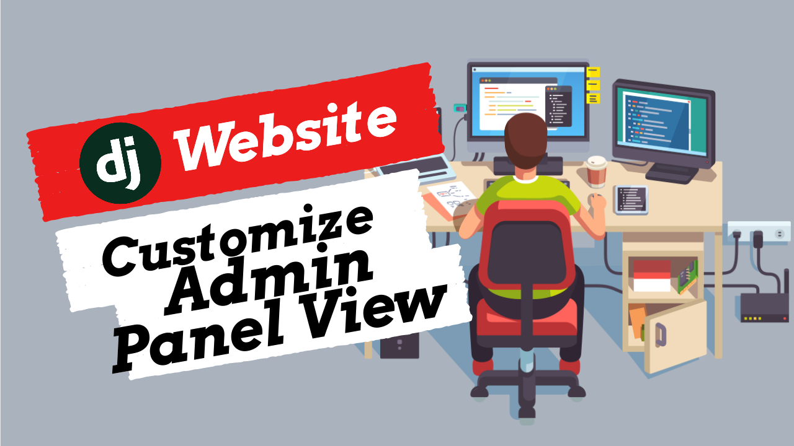

hi guys,welcome to your third django tutorial.

In this video will be dealing with data association and linking.

We will find out how we can associate some tutorials and comments to a tutorial series,some likes and dislikes to a comment.

Django models operate by on relational database systems so they support relationships among one another.

 The database relationships are used to associate records on the basis of a key or id, resulting in improved data maintenance, query performance, and less duplicate data, among other things.
 
 Django models support the same three relationships supported by relational database systems: one to many, many to manym and one to one.

For our case we will specifically dwell on the one to many relationship since its the one we will be applying on our database.

A one to many relationship implies that one model record can have many other model records associated with itself.

Take the example we highlighted in the previous video on tv show how to get away with murder.The show has 6 seasons,each seasons having a list of 10 episodes.

That illustrates the one to many relationship where one season has many episodes.

Coming back to our theory,the tutorial series class needs to be linked to several tutorials and comments and the comment class linked to likes and dislikes.

-------------------------------------------------------------------------
Alright,so in the last video,what we did is create our basic model tables.Now in this video we want to create relationships between these models.

So how are going to do this? 

Well,to define a one to many relationship in Django models you use the ForeignKey data type on the model that has the many records as a model field.
```
tutorial_series = models.ForeignKey()
```

The models.ForeignKey() definition creates the one to many relationship, where the first argument indicates the relationship model.

For our case is Tutorial series
```
tutorial_series = models.ForeignKey(TutorialSeries)
```
So,ill go ahead and set the null and blank value to true since we dont want to have any issues when adding items to our database.
```
tutorial_series = models.ForeignKey(TutorialSeries,null=True,blank=True)
```
The last thing we need to do on this foreign key is to add an on_delete method.

And what this is,is basically saying that whenever a series is deleted,what do we do with the tutorial child?

In this case,ill just say on_delete,models.CASCADE.
```
tutorial_series = models.ForeignKey(TutorialSeries, on_delete=models.CASCADE,blank=True, null=True)
```
So what this does is,when the referenced object is deleted,also delete the objects that have references to it.

Now ill just go ahead and copy past this to the rest of the necessary model classes
```


class Comment(models.Model):
	tutorial = models.ForeignKey(TutorialSeries,on_delete=models.CASCADE,blank=True, null=True)

	def __str__(self):
		return 'Comment by {} of {}-{}'.format(self.name, self.email,self.created_on)


class Like(models.Model):
    comment = models.ForeignKey(Comment,null=True,on_delete=models.SET_NULL)

    def __str__(self):
        return str(self.comment)


class Dislike(models.Model):
    comment = models.ForeignKey(Comment,null=True,on_delete=models.SET_NULL)

    def __str__(self):
        return str(self.comment)
```
If you remember on the prevous video,i had commented out the like and dislike models on admin.py.

So i'll first uncomment them out.

In order to make this work,lets go ahead and run the migrations,so :
```
python3 manage.py makemigrations
```
The migrations are made,lets go ahead and run the migrations now,
```
python3 manage.py migrate
```
Ok,so that just created the relationship,lets relaunch our server to test it out on our admin panel.

So if i create a new tutorial,you can see up here i can select a series to associate with.It list the available series in the database.This is so since we have set the tutorial must be associated with the series model.
Yeah,that's it for this video.Thanks for watching.

----------------------------------------------------------------------


Hi guys,in this video will explore on ways we can customize the admin panel to allow us organize how this model is presented to us. It's not always the case that the order of the columns in the table is what we prefer.

Also we need to customize the tutorial content field into a text editor, for us to be able to write readable content having a blend of code snippets and media utilities like videos or images.So lets get started

---------------------------------------------------------------------------------


One thing my tutorials could use is an editor, not just some text field.I would like a what you see is what you get editor. Luckily many of these exist within the Django ecosystem. The one I will make use of is a branch off of TinyMCE. To get it, we just need to do:
```
pip3 install django-tinymce4-lite.
```
Now this is an app that will over-ride the text field type to make it more of an editor, so we need to add it to our INSTALLED_APPS in the mysite/mysite/settings.py file:
```
INSTALLED_APPS = (
    ...
    'tinymce',
    ...
)
```
The text editor will surely need some configurations,like the widgets to include,plugins,height,width,toolbar content,menubar or even status bar.So what ill do is copy paste the configuration.As you can see its just an object notation.If you like to follow up on these and many other features the text editor has to offer,link will be in the description
```
TINYMCE_DEFAULT_CONFIG = {
    'height': 360,
    'width': 1120,
    'cleanup_on_startup': True,
    'custom_undo_redo_levels': 20,
    'selector': 'textarea',
    'theme': 'modern',
    'plugins': '''
            textcolor save link image media preview codesample contextmenu
            table code lists fullscreen  insertdatetime  nonbreaking
            contextmenu directionality searchreplace wordcount visualblocks
            visualchars code fullscreen autolink lists  charmap print  hr
            anchor pagebreak
            ''',
    'toolbar1': '''
            fullscreen preview bold italic underline | fontselect,
            fontsizeselect  | forecolor backcolor | alignleft alignright |
            aligncenter alignjustify | indent outdent | bullist numlist table |
            | link image media | codesample |
            ''',
    'toolbar2': '''
            visualblocks visualchars |
            charmap hr pagebreak nonbreaking anchor |  code |
            ''',
    'contextmenu': 'formats | link image',
    'menubar': True,
    'statusbar': True,
    }
```
Next thing we need to do is to point our app to tinymce because our widgets will call upon tinymce to work

To do this, let's now edit mysite/mysite/urls.py

```
urlpatterns = patterns('',
    ...
    path('tinymce/', include('tinymce.urls')),
    ...
)
```
Finally, we just need to make use of TinyMCE where we want it. To do this, we need to override a form to use our TinyMCE widget. In this case, it's not just any form, however, we want to use it within the admin page. To do this, go back into our mysite/main/admin.py file, and add the following imports:
```
from tinymce.widgets import TinyMCE
```
Then will add:
```
    formfield_overrides = {
        models.TextField: {'widget': TinyMCE()},
        }
```
The first is for our widget, the second is so we can override one of our models fields (the textfield)

So ill refresh the admin panel page to execute the changes

Awesome! So this editor allows us to easily write HTML, insert code snippets and many other things.We can also view the raw HTML and insert our own custom HTML as well if something we want doesn't exist in the editor.

While we're here, let's go ahead and add a quick tutorial with a code snippet just for kicks. Put whatever you want, give it a title, and save.

Let's now head back to our views to learn how our views can interact with our models, as well as how the Django templating works for displaying and working with python objects inside of HTML templates

# URLS AND VIEWS


Hi guys,In this video am going to cover the concept of url routing in django & how urls and views work together to return templates to a user.

So when a user asks for a URL,django matches the request against its urls.py file.

 If a match is found, Django moves on to the view that’s associated with the URL. Views are generally found inside each app in the views.py file.

 The view generally handles all the database manipulation. It grabs data and passes it on.

 A template (specified in the view) then displays that data.

 for example if we go to the project's urls.py file,under the urls pattern array object,we find a path indicating a string of "admin/".
 ```
 urlpatterns = [
    path('admin/', admin.site.urls),
]
 ```
 This line means that for every URL that starts with admin/, Django will find a corresponding view. 

 Lets now create our own urls to route us to the requests.

 ----------------------------

 The first route we can start with is the landing page or call it the index page of our website.So we need to replace the django default start page.

 Howerver,We also want to keep the mysite/urls.py file clean, so we will import URLs from our main app to the main mysite/urls.py file.This is so since we can create an app with multiple apps,hence this ensures that every routing system of every app is isolated and treated independently.

 Go ahead, add a line that will import blog.urls. You will also need to change the from django.urls… line because we are using the include function here, so you will need to add that import to the line.

 ```
 .....
 from django.urls import path,include
 ......

urlpatterns = [
    path('admin/', admin.site.urls),
    path('', include('main.urls')),
    path('tinymce/', include('tinymce.urls')),
]
 ```
Now Django will now redirect everything that comes into 'http://127.0.0.1:8000/' to main.urls and looks for further instructions there.

Alright,since every route is being redirected to the urls.py file inside our main app,we need to create the file and add these two lines.Ill just copy paste them.
```
from django.urls import path
from . import views
```
Here we're importing Django's function path and all of our views from the main application.We don't have any yet, but we will get to that in a minute

After that, we can add our first URL pattern:

```
urlpatterns = [
path("",views.Homepage),
]
```

The path method takes in the first parameter as the route,which is also the address.for our case is the empty string meaning it is the homepage.The second parameter is the view function,which is the function to be triggered when we route to that address.The third is kwargs argument that allows additional arguments to the view function.Lastly is the name which we may cover later.

Now since we imposed a view function called homepage on the view file,we need to define the function.So ill go to the views.py file.

First, i'll import the class HttpResponse from the django.http module,

```
from django.http import HttpResponse
```
Next, i'll define a function called Homepage. This is the view function.According to django documentation,Each view function takes an HttpRequest object as its first parameter, which is  named request.


```
def Homepage(request):
    return HttpResponse("this is the homepage")
```
the command "wipefs" can erase filesystem, raid or partition-table signatures (magic strings) from the specified device to make the signatures invisible for libblkid. wipefs does not erase the filesystem itself nor any other data from the device.


We now need to render a template response since they return responses that are dynamic and can be easily altered,unlike the static http response.What i mean with template response is returning an actual html page as the object returned.


--------------------------------------------------------------------------------------------

Hi guys,recently i have been trying the adobe sequence programs specifically on the after effects and photoshop.I tried my first learning example by creating an audio visualizer that plays at the beginning of thus video.I created the animation for my featuring youtube channel,deejay nyash,do check it out.

I must say media design and customiztion is no easy job.Especially when starting out.It needs alot of patience and resilience.
If i recall well of an african proverb,quote on quote "Smooth seas do not make skillful sailors."In this video i want to quickly go thru the steps i took or better yet the struggles i had in starting out After Effect Audio spectrum visualizer.

-------------------------------------

first i needed a logo of which i got a good design in canva.Canva is a design website where you just drag and drop objects for customiztion of its featurs.After few edits,i downloaded a transparent background png.

Next is on the after effect app.This is where the video was quite handy.So i created a new composition with its default settings.The duration of the composition should be equal to your audio.

Then I imported the logo,a background image and an audio to sync the visualizer.

Drag all the files except for the background image to the timeline panel below

For the logo,i found it too large so i scaled it to 50%.

Next is the audio spectrum,you right click,then new then solid.Leave all settings as default and press ok.

On the toolbar,go to effects tab,under generate,audio spectrum.Then change both colors to white.Set the audio layer to your choice of audio/music.This links your music with your audio spectrum

I then played around with the rest of the settings as i observed the changes that it effected.

Upon satisfaction,i needed to wrap it around the logo.I added an effect by the name polar cordinates which is under the distort tab.

Set its interpolation to 100% and type of conversion to the first option "rect to polar"

CHange the scale to be precisely in line with the logo,for my case was around 74 and 75%.

Next we need to mirror the left side to be the same on the right side.To do this i added an effect called "mirror" still under the distort tab and the reflection center to be 960

We need to make the logo bounce abit sychroniously with the audio.

First you right click on the audio layer,under keyframe assistance,convert to keyframes

Once created,under effects,delete the right and left channels since we need both.

Next,create an adjustment layer which will add a magnify effect.Change the center to 9600,magnification to 100

We now need to make the magnification synchronous with the timeline keyframes,so we left click it together with "Alt"

This will give you an expression.In here you type 100 + and drag this to slider then *0.

next i dragged the background image to the timeline and scaled it up a bit

It was now time to render the 10 min video.I wanted it to be absolutely perfect,customized to best video qualities to render.

Then came my shock,the time remaining,15 hours.I left the machne running the whole night for it to complete rendering.

Once it was done,i played the video,i must say it was superb,fantasic and any other good adjective you can think of.

but i realized it was kind of taking time to buffer at some points,then i decided to check its properties.Guys you wont believe this but it was 108 gb of space.a 10 minute video of 108gb!


Nasio Fontaine - Black Tuesday
Kings And Comrades - Life Is Alright (New Song 2018)
Magic - Rude (Reggae Remix) 2015

